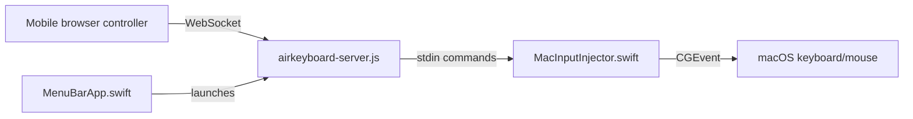

# AirKeyboard

AirKeyboard turns an iPhone, iPad, or other mobile browser into a local Wi-Fi keyboard and trackpad for macOS. The phone opens a web controller, the Mac runs a small Node.js/WebSocket server, and a native Swift helper injects keyboard and mouse events through macOS CoreGraphics.

<p align="center">
  
  &nbsp;&nbsp;&nbsp;&nbsp;&nbsp;&nbsp;&nbsp;&nbsp;
  
</p>

It is useful for headless Mac setups, quick remote input on the same network, or as an emergency keyboard/trackpad when a physical device is unavailable.

## Features

- **Zero App Install:** Connect instantly via any mobile web browser on the same Wi-Fi network (no App Store download required).
- **Responsive Trackpad:** Supports smooth pointer movements, single-finger tap (left click), two-finger tap (right click), and natural two-finger scrolling.
- **Virtual Keyboard:** Dedicated on-screen keys for `Esc`, `Tab`, `Delete`, `Space`, `Enter`, and Arrow keys.
- **Minimal macOS Menu Bar App:** Runs headlessly in the background, showing your login PIN and a click-to-copy connection link.
- **Smart Connection Security:** Generates a random 4-digit PIN for new sessions and securely saves trusted-device tokens.
- **Automatic Port Allocation:** Dynamically finds and binds to a free network port if the default port `3000` is busy.

## Requirements

- macOS 10.15 or later.
- Node.js 16 or later.
- Swift compiler (`swiftc`), usually installed with Xcode Command Line Tools.
- A mobile device on the same trusted local network.

## Quick Start

Run AirKeyboard from the repository:

```bash
./start-airkeyboard.sh
```

The script installs the Node dependency if needed, compiles the Swift input helper if needed, and starts the local server. The terminal prints URLs and a pairing code:

```text
AirKeyboard Server is running (HTTP)!
Open browser on your iOS device and go to:
http://192.168.1.15:3000
http://Your-Mac.local:3000

Access Code for this session: 6590
```

Open one of the URLs on your mobile device, enter the 4-digit code, then use the browser page as a keyboard and trackpad.

## Installation & Setup

You can either download the pre-compiled application directly or build it from source.

### Method 1: Direct Download (Easiest)

1. Download the latest `AirKeyboard.zip` from the **Releases** page on GitHub and extract it.
2. Drag `AirKeyboard.app` into your `/Applications` folder.
3. Open Terminal and run this command to bypass the macOS Gatekeeper warning (required for unnotarized local developer apps):
   ```bash
   xattr -d com.apple.quarantine /Applications/AirKeyboard.app
   ```
4. Launch `AirKeyboard.app` from your Applications folder.

### Method 2: Build from Source (Developers)

If you prefer to compile and build the app bundle yourself:

1. Clone the repository:
   ```bash
   git clone https://github.com/username/air-keyboard.git
   cd air-keyboard
   ```
2. Build the app bundle with the default keycap icon:
   ```bash
   ./build-macos-app.sh
   ```
   *(You can pass a custom PNG/JPG path to override the default icon: `./build-macos-app.sh /path/to/icon.png`)*
3. Move the generated `AirKeyboard.app` into `/Applications` and launch it.

## macOS Accessibility Permission

macOS requires Accessibility permission before an app can post global keyboard and mouse events.

1. Open System Settings.
2. Go to Privacy & Security > Accessibility.
3. Enable the terminal app or `AirKeyboard.app`, depending on how you launch AirKeyboard.

If permission is granted, the server logs show `[Helper] READY`.

## Security Notes

AirKeyboard gives paired devices the ability to control your Mac keyboard and mouse. Use it only on trusted local networks.

- The server is HTTP/WebSocket on the local network, not end-to-end encrypted.
- A new 4-digit pairing code is generated on each server startup.
- Trusted browser tokens are stored in mobile `localStorage`; server-side token records are hashed in `trusted_tokens.txt`.
- Delete `trusted_tokens.txt` to revoke all trusted devices.
- Do not publish generated files such as `AirKeyboard.app`, `keyboard-helper`, `session_info.json`, or `trusted_tokens.txt`.

## How It Works



1. `public/mobile-controller.js` captures text input, button presses, and trackpad gestures in the mobile browser.
2. `airkeyboard-server.js` serves the controller, authenticates clients, validates input messages, and forwards commands to the helper.
3. `MacInputInjector.swift` reads commands from stdin and posts native macOS keyboard/mouse events.
4. `MenuBarApp.swift` provides the optional native menu bar launcher and status UI.

## Project Files

- `airkeyboard-server.js` - local HTTP/WebSocket server and authentication layer.
- `public/index.html` - browser entry point for the mobile controller.
- `public/mobile-controller.js` - mobile keyboard and trackpad interaction logic.
- `public/mobile-controller.css` - mobile controller UI styling.
- `assets/app-icon.png` - source image used for the generated macOS app icon.
- `MacInputInjector.swift` - native macOS keyboard/mouse event injector.
- `MenuBarApp.swift` - native macOS menu bar app.
- `start-airkeyboard.sh` - local startup script.
- `build-macos-app.sh` - native `.app` bundle builder.

## Development

Run syntax checks:

```bash
npm test
```

Compile Swift files manually:

```bash
npm run build:helper
npm run build:gui
```

## License

MIT. See [LICENSE](LICENSE).
