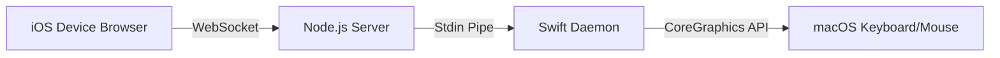

# AirKeyboard 🚀

An ultra-low latency, zero-configuration wireless keyboard & trackpad that turns your iOS device (or any mobile device) into a virtual input accessory for macOS. It works entirely over local Wi-Fi/WebSockets, requiring **zero app installations** on your mobile device and **zero USB ports** on your Mac!

Perfect for macOS users with occupied USB ports, headless Mac setups, or when your physical keyboard/mouse stops working.

---

## Features

- ⚡ **Ultra-Low Latency:** Uses WebSockets for persistent client-server communication (~1-2ms) and a persistent macOS native Swift daemon to perform instant keystroke and mouse event injection.
- 📱 **Zero Mobile Installs:** Runs directly inside Safari or Chrome on your iOS/Android device.
- 🔍 **Auto-Discovery via Bonjour/mDNS:** Accessible via a local hostname (e.g. `http://your-mac-name.local:3000`), meaning you don't need to look up or memorize your Mac's IP address!
- 🖱️ **Remote Trackpad (Mouse Mode):** Slide your finger on the mobile screen to move the macOS mouse cursor. Supports:
  - **Left Click:** Single-finger tap.
  - **Right Click:** Two-finger tap.
  - **Scroll:** Two-finger drag (supports natural scrolling).
  - **Click Buttons:** Dedicated physical virtual buttons for Left/Right click.
- 🔑 **Session Token Authentication (Trust Device):** Generates a new random 4-digit code in the terminal at *every startup* for maximum security. When entered once, the iOS device receives a secure token that is saved in `localStorage`. Subsequent connections pair automatically, bypass the code screen, and establish trust instantly, even across Mac restarts!
- 🔌 **Auto Port Detection:** Automatically scans and binds to the next available port if port `3000` is currently occupied by another service.
- ⌨️ **Special Keys & D-Pad:** Virtual buttons for `Esc`, `Tab`, `Delete`, `Space`, `Enter`, and Arrow keys (`▲` `▼` `◀` `▶`) for easy cursor navigation.

---

## Requirements

- **macOS:** 10.15 (Catalina) or later.
- **Node.js:** v16 or later.
- **Swift Compiler (`swiftc`):** Usually comes pre-installed with macOS Command Line Tools.
---

## macOS Native GUI App (Recommended)

Instead of launching through a terminal window, you can run AirKeyboard as a native macOS GUI application! It comes with a custom glowing app icon, is fully self-contained, and features a sleek dark mode dashboard.

### Features
*   🟢 **Server Status:** Live green/red indicator showing if the server is active or offline.
*   🔑 **Highly Visible Access Code:** The 4-digit code is displayed in a large, prominent font inside the window.
*   🔗 **Clickable Hostnames:** Click the Bonjour host link directly inside the GUI to open Safari.
*   🔌 **One-Click Toggle:** Click **START SERVER** or **STOP SERVER** to turn the server on/off natively.
*   👥 **Active Devices Tracker:** Shows the name and IP of the connected iOS device in real-time.

### Installation
1.  Drag the compiled **[AirKeyboard.app](file:///Applications/AirKeyboard.app)** to your Mac's `/Applications` folder.
2.  Open it from your **Launchpad** or **Spotlight Search**.
3.  *(Optional)* Recompile the application bundle with a custom icon image of your choice:
    ```bash
    ./build-app.sh <path_to_custom_image_png_or_jpg>
    ```

---

## Quick Start

1. **Clone or download** this repository to your Mac.
2. In your Terminal, navigate to the project folder and run the startup script:
   ```bash
   ./run.sh
   ```
   *(This script will automatically install Node dependencies, compile the Swift helper binary, and launch the server).*
3. The Terminal will print your local IP address, your Bonjour hostname, the generated Access Code for this session, and instructions:
   ```text
   ==========================================
   AirKeyboard Server is running (HTTP)!
   Open browser on your iOS device and go to:
   👉 http://192.168.1.15:3000
   👉 http://Wildans-MacBook-Pro.local:3000
   ------------------------------------------
   Access Code for this session: 6590
   ==========================================
   ```
4. Open the local hostname URL (e.g., `http://Wildans-MacBook-Pro.local:3000`) on your iOS device's browser.
5. Enter the **Access Code** shown in your terminal once to trust your iOS device, and start typing/controlling your mouse!
6. Next time you start the server, the code will be different, but your iOS device will connect automatically without prompting for the code again.

---

## Important: macOS Accessibility Permissions

macOS restricts global keyboard and mouse simulation for security. The first time you press a key or move the mouse using AirKeyboard, your Mac will ask for **Accessibility permissions**.

To allow it:
1. Open **System Settings** on your Mac.
2. Go to **Privacy & Security** > **Accessibility**.
3. Toggle the switch **ON** for **Terminal** (or whichever terminal app you are using, like iTerm, VSCode, or Node).

If permissions are set up correctly, you should see `[Helper] READY` in the server logs.

---

## How It Works Under the Hood



1. **iOS Device Browser (`app.js`):** Captures typing, buttons, and trackpad gestures, sending them instantly as custom protocols (`TXT:`, `KEY:`, `MSE:`) over a WebSocket connection.
2. **Node.js Server (`server.js`):** Receives the WebSocket messages and forwards them directly to the `stdin` of the Swift child process.
3. **Swift Daemon (`KeyboardHelper.swift`):** Runs continuously (avoiding process startup overhead). It reads `stdin` and uses the macOS `CGEvent` CoreGraphics API to simulate hardware key events, mouse movements, clicks, and scroll wheel actions directly into the active application.

---

## License

MIT License. Feel free to use, modify, and distribute!
